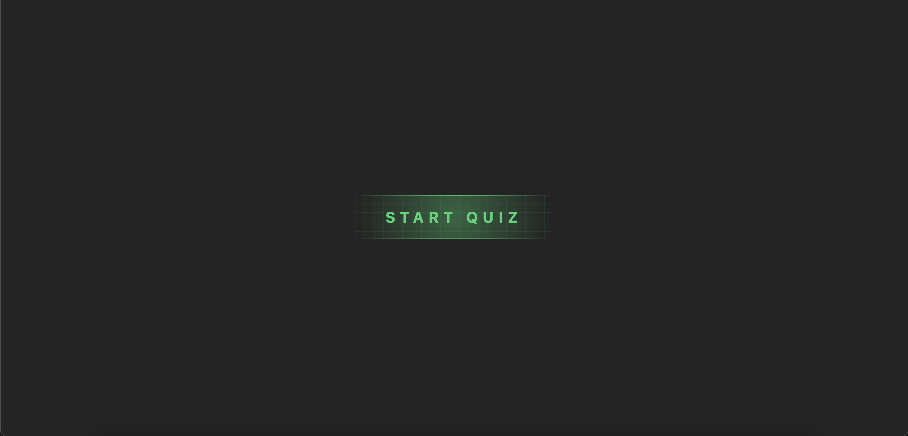
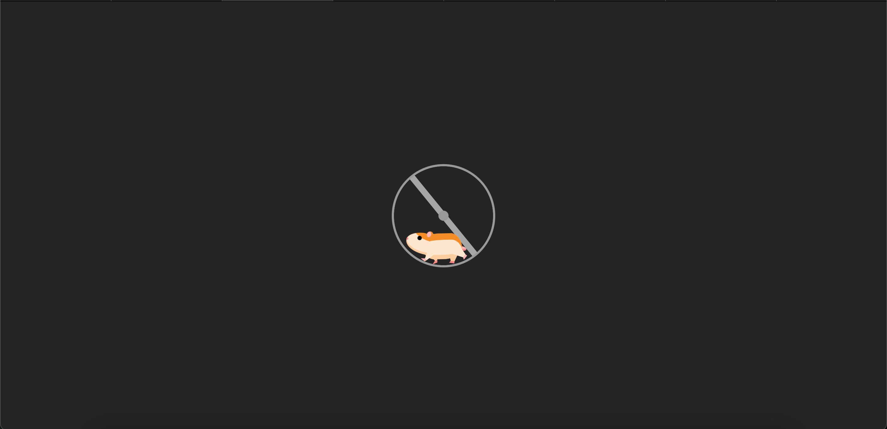
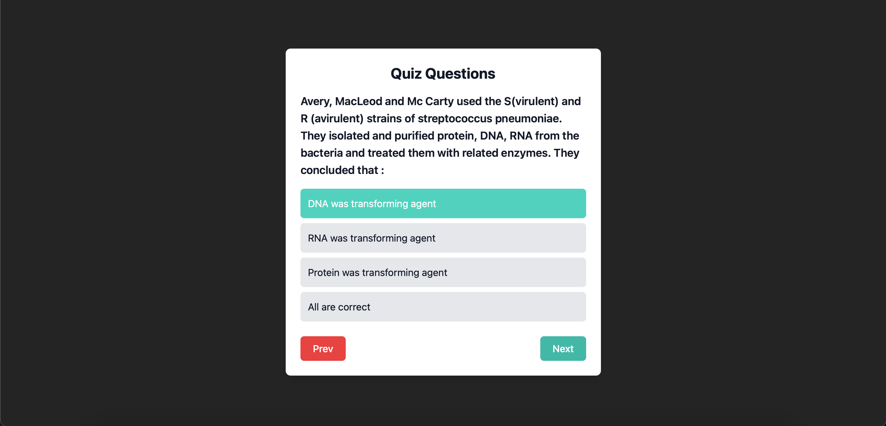
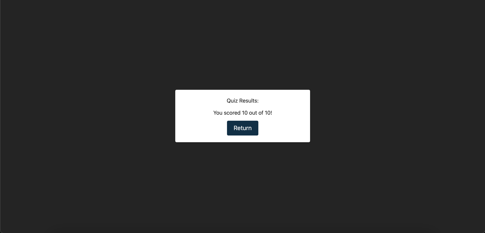

# Quiz App with Gamification

A web-based quiz application with gamification features, built using React and Tailwind CSS. The app fetches quiz data from an API and presents it through an intuitive and engaging user interface.

---

## Features

- **Start Quiz**: Begin the quiz with a single click.
- **Multiple-Choice Questions**: Answer questions from multiple options.
- **Results Summary**: View total points scored after completing the quiz.

---

## Technologies Used

- **Frontend**: React, Tailwind CSS
- **Routing**: React Router DOM
- **State Management**: React Context API
- **API Integration**: Fetch quiz data from an external API using Axios.

---

## Screenshots

### Start Page


### Loading Page


### Quiz Page


### Results Page


---

## Video Walkthrough

[Watch the video walkthrough](./media/videos/demo.mp4)

---

## Setup Instructions

Follow these steps to set up and run the project locally:

### Prerequisites

- Node.js (v16 or higher)
- npm (v8 or higher)

### Installation

1. **Clone the repository**:
> ```bash
> git clone https://github.com/your-username/quiz-app.git
> cd quiz-app
> ```

2. **Install dependencies**:
> ```bash
> npm install
> ```

3. **Start the development server**:
> ```bash
> npm run dev
> ```

4. **Open the app**:
> Visit http://localhost:5173 in your browser.  